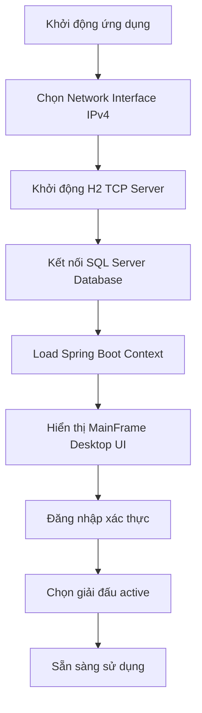
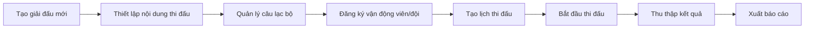
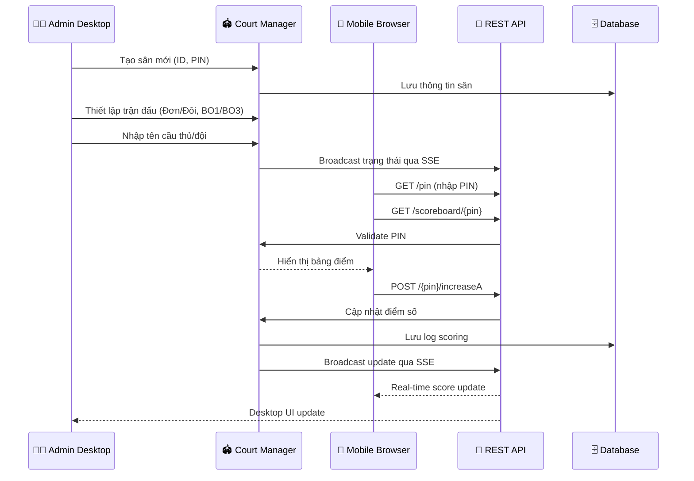
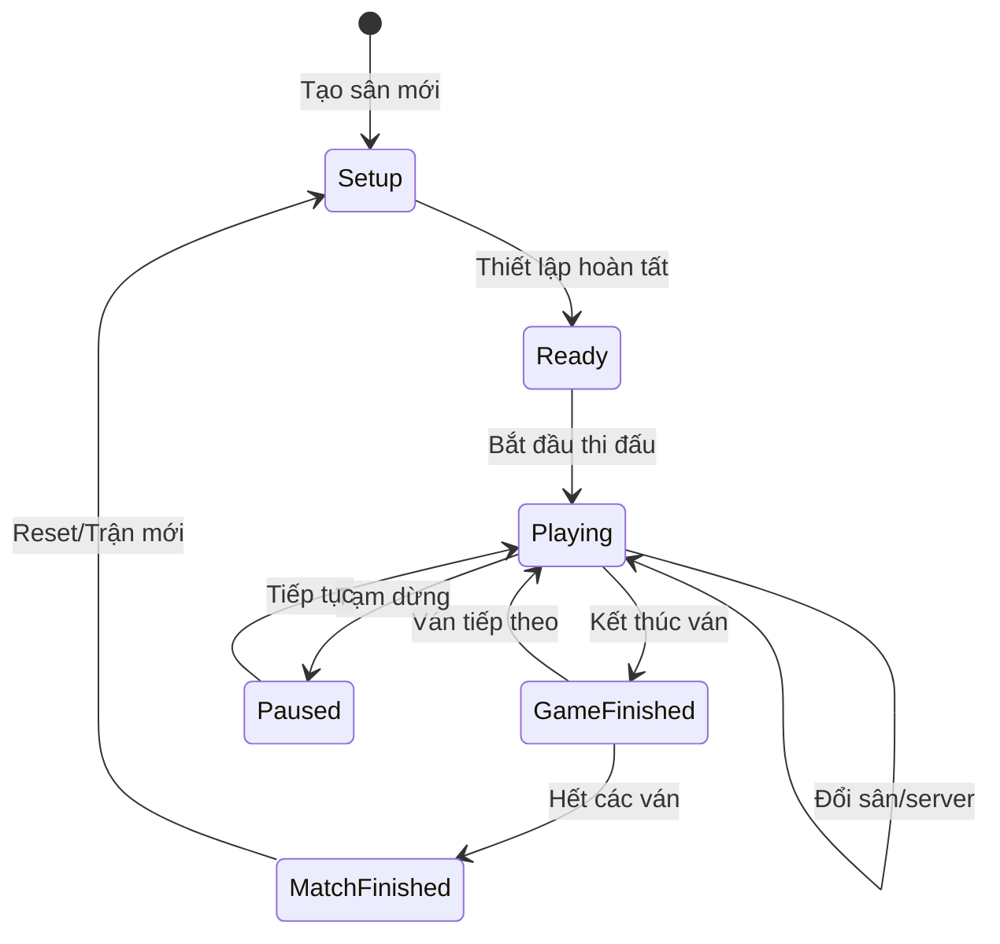
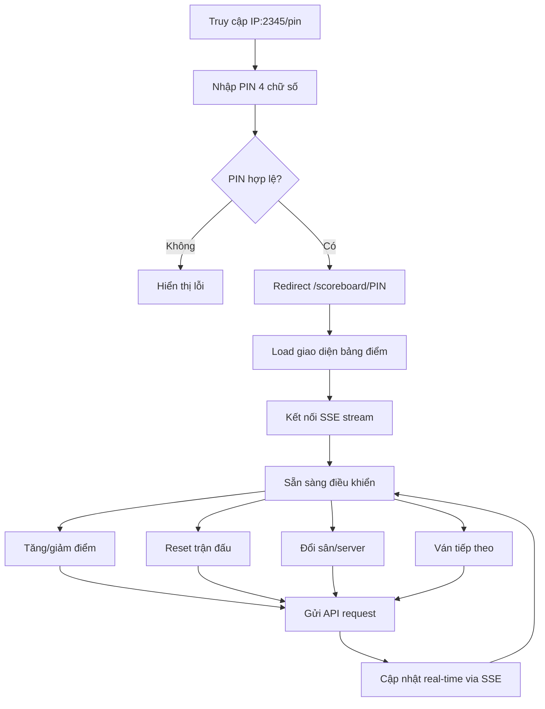
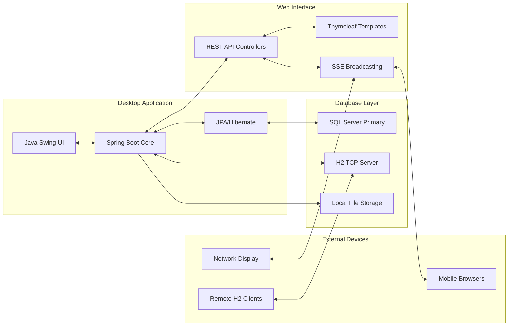
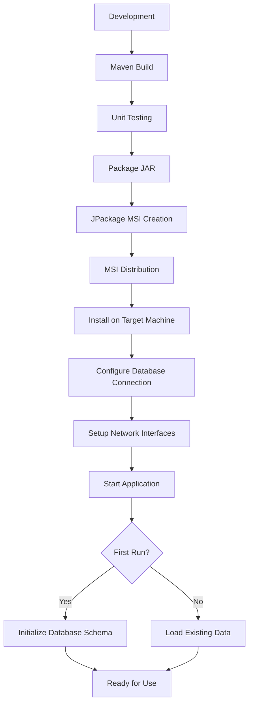
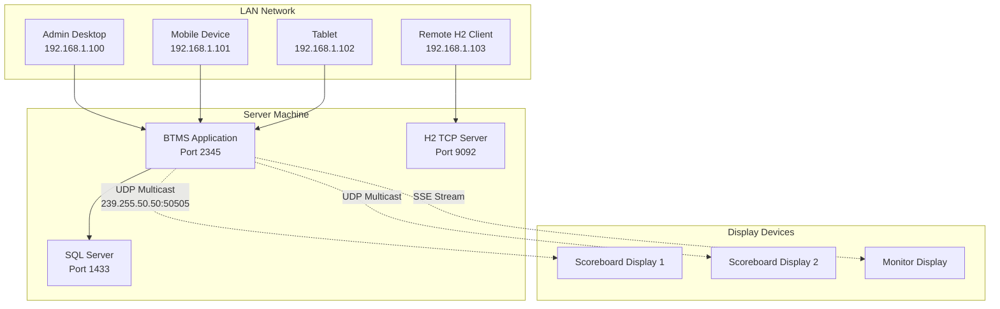
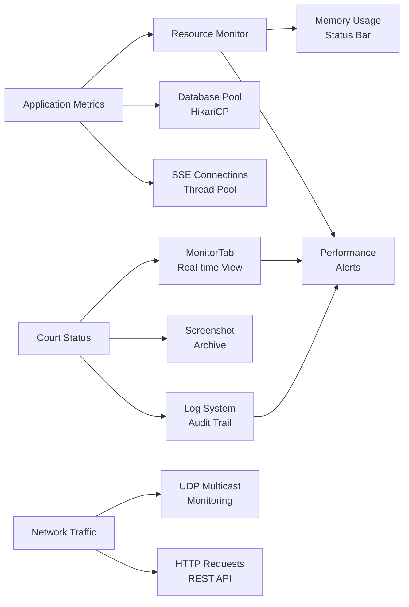

# 📊 BÁO CÁO CÔNG NGHỆ VÀ TÍNH NĂNG · v2

Hệ thống Quản lý Đa sân Cầu lông (Badminton Tech / BTMS)

---

## 📑 Mục lục

### 🎯 TỔNG QUAN HỆ THỐNG
- [📋 Thông tin tổng quan](#-thông-tin-tổng-quan)
- [🎯 Mục tiêu & phạm vi](#-mục-tiêu--phạm-vi)

### 🏗️ KIẾN TRÚC & CÔNG NGHỆ  
- [🏗️ Kiến trúc hệ thống](#️-kiến-trúc-hệ-thống)
- [💻 Công nghệ chính (Tech stack)](#-công-nghệ-chính-tech-stack)
- [⚙️ Cấu hình mặc định quan trọng](#️-cấu-hình-mặc-định-quan-trọng)

### 🚀 TÍNH NĂNG HIỆN TẠI
- [🧭 Điều hướng & màn hình chính (Desktop)](#-điều-hướng--màn-hình-chính-desktop)
- [🏟️ Quản lý đa sân & điều khiển trận đấu](#️-quản-lý-đa-sân--điều-khiển-trận-đấu)
- [🌐 Web interface & PIN flow](#-web-interface--pin-flow)
- [🔌 REST API & SSE](#-rest-api--sse)
- [🗃️ Các mô-đun dữ liệu/ghi nhật ký](#️-các-mô-đun-dữ-liệughi-nhật-ký-trích-yếu)

### 🔮 KẾ HOẠCH TƯƠNG LAI
- [🔮 Phát thảo tính năng dự kiến](#-phát-thảo-tính-năng-dự-kiến)
- [🔄 Luồng hoạt động sơ bộ](#-luồng-hoạt-động-sơ-bộ)

### 🔧 VẬN HÀNH & BẢO TRÌ
- [🧪 Kiểm thử & giám sát](#-kiểm-thử--giám-sát)
- [🔒 Bảo mật & quyền truy cập](#-bảo-mật--quyền-truy-cập)
- [⚡ Hiệu năng & tối ưu](#-hiệu-năng--tối-ưu)
- [📦 Đóng gói & cài đặt (Windows MSI)](#-đóng-gói--cài-đặt-windows-msi)
- [🧭 Hướng dẫn vận hành nhanh](#-hướng-dẫn-vận-hành-nhanh)

---

## 🎯 TỔNG QUAN HỆ THỐNG

### 📋 Thông tin tổng quan
- **Tên dự án**: Badminton Tech (BT) · Badminton Tournament Management System (BTMS)
- **Phiên bản hiện tại**: 2.0.0
- **Nhà phát triển**: Nguyen Viet Hau
- **Kiểu ứng dụng**: Desktop (Java Swing) + Web (Spring Boot + Thymeleaf)
- **Hệ điều hành mục tiêu**: Windows 10/11 64-bit
- **Cổng dịch vụ mặc định**: 2345 (0.0.0.0:2345)

### 🎯 Mục tiêu & phạm vi
- Vận hành giải cầu lông với nhiều sân thi đấu đồng thời trên cùng 1 máy.
- Điều khiển trận đấu trực tiếp từ desktop app; hỗ trợ điều khiển từ xa qua trình duyệt (di động/tablet/PC) bằng mã PIN.
- Theo dõi, giám sát, và đồng bộ trạng thái các sân theo thời gian thực (real-time).
- Quản lý danh mục dữ liệu giải đấu: nội dung thi đấu, câu lạc bộ, đăng ký theo giải,…
- Đóng gói phát hành dạng bộ cài MSI cho Windows (tự động cài đặt JRE kèm ứng dụng).

---

## 🏗️ KIẾN TRÚC & CÔNG NGHỆ

### 🏗️ Kiến trúc hệ thống
```
Java Swing Desktop (MainFrame, các Panel quản trị)
        │
        │ IPC/Service nội bộ
        ▼
Spring Boot (Web + REST API + SSE)  ←→  SQL Server (JDBC/Hikari/JPA)
        │
  ├── Thymeleaf view (/pin, /scoreboard/{pin}) + Static (CSS/JS)
  └── REST API (/api/court/**, /api/scoreboard/**) + SSE stream
```

**Đặc điểm:**
- Ứng dụng desktop và dịch vụ web đồng quy trình (fat-jar Spring Boot, mở Swing UI trong JVM không headless).
- Giao tiếp real-time qua SSE (Server-Sent Events) và/hoặc polling dự phòng.
- Ứng dụng web chạy trên LAN (0.0.0.0:2345) để thiết bị khác (điện thoại/tablet) truy cập.

### 💻 Công nghệ chính (Tech stack)

#### Runtime & nền tảng
- **Java 17** (maven.compiler.release=17)
- **Spring Boot 3.2.6** (parent)
- **Desktop UI**: Java Swing + FlatLaf 3.4 (flatlaf, flatlaf-extras)

#### Web & API
- **Web Framework**: Spring Web MVC + Thymeleaf 3.1
- **Real-time**: Server-Sent Events (SSE)
- **Static resources**: CSS/JS cho responsive UI

#### CSDL & dữ liệu
- **Primary DB**: SQL Server (SQL Server JDBC Driver 12.6.1)
- **Connection Pool**: HikariCP (spring-boot-starter-data-jpa)
- **ORM**: Hibernate/JPA

#### Thư viện bổ trợ
- **Logging**: SLF4J + Logback
- **Utilities**: Apache Commons, Jackson JSON
- **Desktop**: System tray, file dialogs
- **Network**: H2 TCP Server cho remote access

#### Build & phát hành
- **Build Tool**: Maven 3.x
- **Packaging**: maven-jpackage-plugin
- **Target**: Windows MSI với runtime JRE bundle
- **Testing**: JUnit, Spring Boot Test

### ⚙️ Cấu hình mặc định quan trọng

#### Spring Boot Properties (application.properties)
```properties
# Server config
server.port=2345
server.address=0.0.0.0

# Database connection
spring.datasource.url=jdbc:sqlserver://localhost:1433;databaseName=BadmintonDB;encrypt=false
spring.datasource.username=sa
spring.datasource.password=yourpassword
spring.datasource.driver-class-name=com.microsoft.sqlserver.jdbc.SQLServerDriver

# JPA/Hibernate
spring.jpa.hibernate.ddl-auto=update
spring.jpa.show-sql=false
spring.jpa.properties.hibernate.dialect=org.hibernate.dialect.SQLServerDialect

# Web config  
spring.web.resources.static-locations=classpath:/static/
spring.thymeleaf.cache=false
```

#### H2 TCP Server
- **Port**: 9092 (mặc định)
- **Bind address**: 0.0.0.0 (tất cả interfaces)
- **Auto-start**: Tự động khởi động cùng ứng dụng
- **Remote access**: Cho phép kết nối từ máy khác

#### Network Interface
- **IPv4 Only**: Chỉ chấp nhận IPv4, lọc bỏ IPv6
- **Interface selection**: Dialog chọn network interface khi khởi động
- **Fallback**: Sử dụng localhost nếu không chọn được interface

---

## 🚀 TÍNH NĂNG HIỆN TẠI

### 🧭 Điều hướng & màn hình chính (Desktop)

#### MainFrame (JFrame chính)
- **Menu bar**: File, Settings, Tools, Help
- **Tab panels**: 
  - "Sân thi đấu" (BadmintonControlPanel) - Quản lý các sân
  - "Giải đấu" (TournamentPanel) - Quản lý tournament data
  - "Giám sát" (MonitorTab) - Theo dõi tổng thể
  - "Kết quả đã thi đấu" (HistoryTab) - Lịch sử và snapshot

#### System Tray Integration
- **Minimize to tray**: Thu nhỏ xuống system tray
- **Quick actions**: Show/Hide, Exit từ context menu
- **Status indicators**: Icon thay đổi theo trạng thái hoạt động

#### Network Interface Chooser
- **Startup dialog**: Chọn network interface khi khởi động
- **IPv4 filtering**: Chỉ hiển thị interfaces có IPv4 valid
- **Auto-detection**: Tự động detect và ưu tiên interfaces phù hợp

### 🏟️ Quản lý đa sân & điều khiển trận đấu

#### Tạo và quản lý sân
- Tối đa **5 sân** đồng thời (configurable)
- Mỗi sân có **PIN 4 chữ số** unique để remote access
- Thiết lập loại trận: **Đơn nam/nữ, Đôi nam/nữ/mixed**
- Cấu hình số ván: **Best of 1** hoặc **Best of 3**

#### Control Interface cho mỗi sân
- Điểm số real-time với các nút **+/-** cho từng bên
- **Đổi sân** (change ends) và **reset trận đấu**
- **Ván tiếp theo** khi kết thúc ván
- Hiển thị thông tin: tên players/teams, loại trận, trạng thái

### 🌐 Web interface & PIN flow

#### PIN Entry System
- **URL**: `http://[IP]:2345/pin`
- **Input**: Nhập PIN 4 chữ số
- **Validation**: Check PIN có tồn tại và active không
- **Redirect**: Chuyển đến `/scoreboard/{pin}` nếu hợp lệ

#### Responsive Scoreboard
- **Mobile-friendly**: Tối ưu cho điện thoại/tablet
- **Real-time updates**: SSE stream để đồng bộ điểm số
- **Touch controls**: Nút to, dễ nhấn trên touchscreen
- **Auto-refresh**: Fallback polling nếu SSE fail

#### Remote Control Features
- **Score management**: Tăng/giảm điểm từng bên
- **Match control**: Đổi sân, reset, ván tiếp theo  
- **Status display**: Hiển thị trạng thái match hiện tại
- **Error handling**: Thông báo lỗi khi action fail

### 🔌 REST API & SSE

#### Court Management API
```http
GET    /api/court/all                    # Lấy danh sách tất cả sân
POST   /api/court/create                 # Tạo sân mới
DELETE /api/court/{pin}                  # Xóa sân
POST   /api/court/{pin}/reset            # Reset trận đấu
```

#### Scoreboard API  
```http
GET    /api/scoreboard/{pin}             # Lấy trạng thái sân
POST   /{pin}/increaseA                  # Tăng điểm bên A
POST   /{pin}/increaseB                  # Tăng điểm bên B  
POST   /{pin}/decreaseA                  # Giảm điểm bên A
POST   /{pin}/decreaseB                  # Giảm điểm bên B
POST   /{pin}/changeEnds                 # Đổi sân
POST   /{pin}/nextGame                   # Ván tiếp theo
```

#### Server-Sent Events (SSE)
```http
GET    /api/sse/scoreboard/{pin}         # SSE stream cho sân
GET    /api/sse/courts                   # SSE stream tổng thể
```

**SSE Event Types:**
- `score-update`: Cập nhật điểm số
- `match-status`: Thay đổi trạng thái trận đấu
- `court-created`: Sân mới được tạo
- `court-deleted`: Sân bị xóa
- `system-status`: Trạng thái hệ thống

#### Response Format
```json
{
  "success": true,
  "message": "Action completed successfully",
  "data": {
    "pin": "1234",
    "scoreA": 15,
    "scoreB": 12,
    "gameA": 1,
    "gameB": 0,
    "matchType": "MEN_SINGLES",
    "maxGames": 3,
    "status": "PLAYING"
  },
  "timestamp": "2025-10-20T13:45:30"
}
```

### 🗃️ Các mô-đun dữ liệu/ghi nhật ký (trích yếu)

#### Tournament Data Management
- **Tournaments**: Quản lý thông tin giải đấu
- **Contents**: Nội dung thi đấu (đơn nam, đôi nữ, v.v.)
- **Clubs**: Danh sách câu lạc bộ tham gia
- **Registrations**: Đăng ký vận động viên theo giải

#### Court & Match Logging
- **Court states**: Lưu trạng thái sân theo thời gian
- **Score history**: Lịch sử thay đổi điểm số
- **Match results**: Kết quả trận đấu hoàn tất
- **System events**: Log hoạt động hệ thống

#### File Storage
- **Screenshots**: Capture màn hình scoreboard
- **Exports**: Xuất dữ liệu ra file (CSV, JSON)
- **Backups**: Sao lưu dữ liệu định kỳ
- **Logs**: File log hệ thống và error

---

## 🔮 KẾ HOẠCH TƯƠNG LAI

### 🔮 Phát thảo tính năng dự kiến

#### 📋 Tính năng đã hoàn thành (v2.0.0)
- ✅ **Quản lý đa sân**: Hỗ trợ tối đa 5 sân đồng thời với PIN unique
- ✅ **Real-time control**: Desktop + Web interface, SSE streaming
- ✅ **Tournament management**: Giải đấu, nội dung, câu lạc bộ, đăng ký
- ✅ **H2 TCP Server**: Remote database access cho máy khác
- ✅ **IPv4 filtering**: Network interface chỉ nhận IPv4
- ✅ **MSI packaging**: Windows installer với JRE bundled
- ✅ **Responsive web UI**: Mobile/tablet friendly scoreboard
- ✅ **Multi-display support**: Vertical/horizontal scoreboards

#### 🚧 Phiên bản 2.1 (Đang lên kế hoạch)

##### 🌐 Quốc tế hoá & Bảo mật
- [ ] **Multi-language Support**: 
  - Interface tiếng Anh/Việt Nam
  - Localization cho templates và messages
  - Dynamic language switching
- [ ] **Enhanced Security**:
  - JWT token authentication cho API
  - Role-based access control chi tiết hơn
  - PIN encryption và session management
  - HTTPS support với SSL certificates

##### ☁️ Cloud & Mobile
- [ ] **Cloud Integration**:
  - Auto backup tournament data lên cloud storage
  - Real-time sync giữa multiple venues
  - Cloud-based tournament analytics
- [ ] **Mobile Applications**:
  - Native Android/iOS companion app
  - Referee mobile app với offline capability
  - Push notifications cho score updates
  - QR code scanner integration

##### 📊 Analytics & Reporting
- [ ] **Advanced Analytics**:
  - Match statistics và performance metrics
  - Player/team performance tracking
  - Tournament trend analysis
  - Export reports (PDF, Excel, CSV)
- [ ] **Tournament Bracket System**:
  - Automated bracket generation
  - Draw management với seeding
  - Knockout/round-robin tournaments
  - Live bracket updates

#### 🔮 Phiên bản 3.0 (Tương lai xa)

##### 🏗️ Kiến trúc & Scale
- [ ] **Microservices Architecture**:
  - Tách thành services độc lập (Court, Tournament, User, Analytics)
  - API Gateway và service discovery
  - Docker containerization
  - Kubernetes orchestration
- [ ] **Multi-venue Support**:
  - Sync tournaments across multiple locations
  - Central management dashboard
  - Venue-specific configurations
  - Cross-venue competitions

##### 🤖 AI & Automation
- [ ] **AI-powered Features**:
  - Computer vision auto-scoring
  - Video analysis và highlight generation
  - Predictive analytics cho match outcomes
  - Smart scheduling optimization
- [ ] **Live Streaming Integration**:
  - Real-time video streaming
  - Multi-camera support
  - Automated highlight clips
  - Social media integration

##### 🎯 Advanced Features
- [ ] **Player Rating System**:
  - ELO-based ranking algorithm
  - Performance tracking over time
  - Skill level assessments
  - Matchmaking recommendations
- [ ] **Sponsor & Commercial**:
  - Advertisement management system
  - Branding customization
  - Revenue tracking
  - Sponsor portal integration

#### 💡 Community & Development

##### 🤝 Open Source Contributions
- [ ] **Plugin Architecture**: Extensible system cho custom features
- [ ] **API Documentation**: Comprehensive REST API docs
- [ ] **SDK Development**: Client libraries cho third-party integration
- [ ] **Community Portal**: Feature requests, bug reports, discussions

##### 🧪 Quality & Performance
- [ ] **Testing Suite**: Unit, integration, và e2e testing
- [ ] **Performance Monitoring**: Real-time performance metrics
- [ ] **Load Testing**: Support cho large-scale tournaments
- [ ] **Accessibility**: WCAG compliance cho web interfaces

### 🔄 Luồng hoạt động sơ bộ

#### 📋 Workflow tổng quan hệ thống

##### 🚀 Quy trình khởi động (Startup Flow)


##### 🏆 Quy trình quản lý giải đấu (Tournament Management)


#### 🏟️ Quy trình quản lý sân thi đấu

##### 🎮 Thiết lập và điều khiển sân (Court Management Flow)


##### 📊 Chu trình thi đấu (Match Lifecycle)


#### 🌐 Luồng Web Interface

##### 📱 Quy trình điều khiển từ xa (Remote Control Flow)


#### 🔄 Luồng dữ liệu (Data Flow)

##### 💾 Luồng lưu trữ và đồng bộ (Data Sync Flow)


#### 🔧 Luồng setup và deployment

##### 📦 Quy trình triển khai (Deployment Process)


##### 🌐 Network Architecture Flow


#### ⚡ Performance & Monitoring Flow

##### 📈 Luồng giám sát hiệu năng


---

## 🔧 VẬN HÀNH & BẢO TRÌ

### 🧪 Kiểm thử & giám sát

#### Testing Strategy
- **Unit Tests**: JUnit cho logic core
- **Integration Tests**: Spring Boot Test cho API
- **Manual Testing**: UI testing cho desktop components
- **Performance Testing**: Load testing cho concurrent users

#### Monitoring & Logging
- **Application Logging**: SLF4J + Logback
- **Performance Metrics**: Memory usage hiển thị trên status bar
- **Error Tracking**: Exception logging và user notification
- **System Health**: Database connection status, SSE connection count

### 🔒 Bảo mật & quyền truy cập

#### Current Security Measures
- **PIN-based Access**: 4-digit PIN cho mỗi sân
- **Local Network**: Chỉ chạy trên LAN, không expose ra internet
- **Input Validation**: Validate tất cả API inputs
- **Session Management**: Temporary sessions cho web interface

#### Security Considerations
- **No Authentication**: Chưa có user authentication system
- **PIN Enumeration**: 4-digit PIN có thể bị brute force
- **HTTP Only**: Chưa hỗ trợ HTTPS
- **Database Security**: SQL injection protection qua JPA

### ⚡ Hiệu năng & tối ưu

#### Performance Optimizations
- **Connection Pooling**: HikariCP cho database connections
- **Lazy Loading**: JPA lazy loading cho entities
- **Static Resource Caching**: Browser caching cho CSS/JS
- **SSE Efficiency**: Event-driven updates thay vì polling

#### Resource Management
- **Memory Usage**: Monitor và display trên status bar
- **Thread Management**: Controlled thread pools cho SSE
- **Database Optimization**: Proper indexing và query optimization
- **Garbage Collection**: JVM tuning cho desktop performance

### 📦 Đóng gói & cài đặt (Windows MSI)

#### JPackage Configuration
- **Runtime**: Bundle JRE 17 với application
- **MSI Installer**: Windows native installer
- **Auto-updater**: Future plan cho automatic updates
- **System Integration**: Desktop shortcuts, Start menu entries

#### Installation Process
- **Pre-requisites**: Windows 10/11 64-bit
- **Database Setup**: User cần setup SQL Server trước
- **Network Configuration**: Auto-detect network interfaces
- **First Run**: Configuration wizard cho database connection

### 🧭 Hướng dẫn vận hành nhanh

#### Quick Start Guide
1. **Cài đặt**: Chạy MSI installer
2. **Database**: Thiết lập SQL Server connection
3. **Network**: Chọn network interface IPv4
4. **Tournament**: Tạo giải đấu và nội dung thi đấu
5. **Courts**: Tạo sân với PIN và bắt đầu thi đấu

#### Daily Operations
- **Tạo sân mới**: Chọn loại trận, nhập tên players, generate PIN
- **Remote control**: Share PIN với users để điều khiển từ mobile
- **Monitoring**: Tab "Giám sát" để theo dõi tất cả sân
- **Results**: Tab "Kết quả đã thi đấu" để xem ảnh chụp/snapshot

#### Troubleshooting
- **Connection Issues**: Check network interface và firewall
- **Database Problems**: Verify SQL Server connection string
- **Performance**: Monitor memory usage và restart nếu cần
- **SSE Issues**: Fallback to polling mode tự động

---

## 📊 Kết luận

**Badminton Tournament Management System v2.0.0** là một hệ thống hoàn chỉnh và mạnh mẽ cho việc quản lý giải cầu lông đa sân. Với kiến trúc hybrid desktop/web, hệ thống cung cấp:

### ✅ Điểm mạnh hiện tại
- **Multi-court Management**: Quản lý tối đa 5 sân đồng thời
- **Real-time Control**: Desktop và mobile interface với SSE
- **Cross-platform Access**: Web interface cho mọi thiết bị
- **Professional Deployment**: MSI installer với JRE bundled
- **Robust Architecture**: Spring Boot + SQL Server + Swing UI

### 🚀 Tầm nhìn tương lai
- **v2.1**: Quốc tế hóa, bảo mật nâng cao, cloud integration
- **v3.0**: Microservices, AI features, multi-venue support
- **Community**: Open source contributions và plugin ecosystem

### 🎯 Giá trị cốt lõi
Hệ thống không chỉ là một công cụ quản lý giải đấu mà còn là nền tảng cho việc số hóa và hiện đại hóa các giải cầu lông, mang lại trải nghiệm tốt nhất cho ban tổ chức, trọng tài và khán giả.

---

*Báo cáo được tạo ngày: 20/10/2025*  
*Phiên bản: v2.0.0*  
*Tác giả: Nguyen Viet Hau*