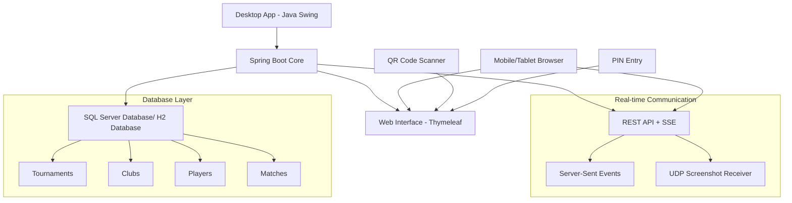

# 🏸 Hệ thống Quản lý Giải đấu Cầu lông (BTMS) · v2.0.0

Hệ thống quản lý giải đấu cầu lông toàn diện với khả năng điều khiển đa sân và giao diện web real-time.


---

## 🎯 Tổng quan dự án

**BTMS (Badminton Tournament Management System)** là một hệ thống quản lý giải đấu cầu lông hiện đại, tích hợp:

- **Desktop Application**: Giao diện quản trị chính với Java Swing + FlatLaf
- **Web Interface**: Điều khiển từ xa qua trình duyệt với mã PIN
- **Real-time Updates**: Đồng bộ dữ liệu trực tiếp qua SSE (Server-Sent Events)
- **Multi-Court Support**: Quản lý nhiều sân thi đấu đồng thời
- **Database Integration**: Tích hợp SQL Server với JPA/Hibernate

### 📊 Thông tin kỹ thuật
- **Phiên bản**: 2.0.0
- **Tác giả**: Nguyen Viet Hau
- **Ngôn ngữ**: Java 17
- **Framework**: Spring Boot 3.2.6
- **Cổng mặc định**: 2345
- **Hỗ trợ**: Windows 10/11 64-bit

---

## 🚀 Tính năng chính

### 🏟️ Quản lý đa sân
- Điều khiển tối đa 5 sân thi đấu đồng thời
- Mỗi sân có mã PIN 4 chữ số duy nhất
- Hỗ trợ cả đơn và đôi (Singles/Doubles)
- Bảng điểm hiển thị dọc/ngang tùy chỉnh

### 📱 Điều khiển từ xa
- Web interface responsive cho mobile/tablet
- Truy cập bằng mã PIN qua `/pin` hoặc `/scoreboard/{pin}`
- Điều khiển điểm số real-time
- QR Code để truy cập nhanh

### 🔄 Đồng bộ thời gian thực
- Server-Sent Events (SSE) cho cập nhật tức thì
- Fallback polling nếu SSE không khả dụng
- UDP receiver cho screenshot monitoring

### 💾 Quản lý dữ liệu
- Quản lý giải đấu, câu lạc bộ, vận động viên
- Đăng ký nội dung thi đấu theo giải
- Lưu trữ kết quả và lịch sử thi đấu
- Phân quyền người dùng (ADMIN/CLIENT)

---

## 🏗️ Kiến trúc hệ thống



### 🔧 Đặc điểm kiến trúc
- **Hybrid Application**: Desktop + Web trong cùng một JVM process
- **Non-headless Mode**: `spring.main.headless=false` để hỗ trợ Swing UI
- **Event-driven**: SSE (SseEmitter) và UDP receiver (port 2346) cho real-time updates
- **Thread-safe**: Concurrent collections và thread pool management

---

## 💻 Công nghệ sử dụng

### 🖥️ Backend & Core
| Công nghệ | Phiên bản | Mục đích |
|-----------|-----------|----------|
| **Java** | 17 | Runtime platform |
| **Spring Boot** | 3.2.6 | Application framework |
| **Spring Web** | - | REST API & Web MVC |
| **Spring Data JPA** | - | Database abstraction |
| **Hibernate** | - | ORM implementation |

### 🎨 Frontend & UI
| Công nghệ | Phiên bản | Mục đích |
|-----------|-----------|----------|
| **Java Swing** | - | Desktop GUI |
| **FlatLaf** | 3.4 | Modern Look & Feel |
| **Thymeleaf** | - | Web template engine |
| **Bootstrap** | 5.3.3 | Responsive web UI |
| **jQuery** | 3.7.1 | JavaScript library |

### 🗃️ Database & Storage
| Công nghệ | Phiên bản | Mục đích |
|-----------|-----------|----------|
| **SQL Server** | - | Primary database |
| **HikariCP** | - | Connection pooling |
| **JDBC Driver** | - | Database connectivity |

### 🔧 Tools & Libraries
| Công nghệ | Phiên bản | Mục đích |
|-----------|-----------|----------|
| **Maven** | - | Build & dependency management |
| **ZXing** | 3.5.2 | QR Code generation |
| **OkHttp** | - | HTTP client |
| **H2** | - | In-memory/file DB phục vụ local testing (runtime) |
| **Jackson** | - | JSON processing |
| **JCalendar** | 1.4 | Date picker component |
| **OpenPDF** | 1.3.39 | PDF generation |

---
### 📋 Yêu cầu hệ thống
- **OS**: Windows 10/11 64-bit

### 🚀 Chạy ứng dụng

#### Từ source code (Windows CMD):
```bat
:: Clone repository
git clone https://github.com/NguyenHau-IT/Badminton_Tournament_Management_System_DB_SQLSRV.git
cd Badminton_Tournament_Management_System_DB_SQLSRV

:: Build và chạy
mvn clean package -DskipTests
java -jar target\btms-2.0.0.jar

:: Hoặc chạy trực tiếp với Maven
mvn spring-boot:run
```

#### Từ MSI installer:
```bat
:: Build MSI package
mvn clean package jpackage:jpackage

:: MSI file sẽ được tạo trong target\dist\
:: Cài đặt bằng cách double-click file MSI
```

### 🎛️ Tối ưu JVM (tùy chọn)
```bat
:: Chạy với memory optimization
java -Xmx4g -XX:+UseG1GC -XX:+UseStringDeduplication -jar btms-2.0.0.jar

:: Hoặc sử dụng file cấu hình jvm-optimization.conf
```

---

## 📚 Hướng dẫn sử dụng

### 🖥️ Giao diện Desktop

#### Khởi động ứng dụng
1. **Network Selection**: Chọn network interface khi khởi động
2. **Database Connection**: Ứng dụng tự động kết nối database
3. **Login**: Đăng nhập với quyền ADMIN hoặc CLIENT
4. **Main Interface**: Truy cập các chức năng chính

#### Các tab chính
- **🏟️ Thi đấu**: Quản lý và điều khiển các sân (MultiCourtControlPanel)
- **👁️ Giám sát**: Theo dõi tất cả sân real-time (MonitorTab)  
- **🏆 Giải đấu**: Quản lý thông tin giải đấu
- **📝 Nội dung**: Quản lý danh mục nội dung thi đấu
- **🏛️ Câu lạc bộ**: Quản lý các câu lạc bộ
- **✍️ Đăng ký**: Đăng ký vận động viên vào nội dung
- **📊 Kết quả**: Xem screenshot các trận đấu
- **📋 Logs**: Xem nhật ký hệ thống

#### Quản lý sân thi đấu
1. **Tạo sân mới**: Chọn số sân (1-5) và nhập tiêu đề
2. **Thiết lập trận đấu**:
   - Loại: Đơn (Singles) hoặc Đôi (Doubles)
   - Số ván: BO1 hoặc BO3
   - Tên cầu thủ/đội
   - Kiểu hiển thị: Horizontal/Vertical
3. **Điều khiển điểm số**: Tăng/giảm điểm, reset, đổi sân, đổi giao cầu
4. **Bảng điểm**: Mở cửa sổ hiển thị bảng điểm toàn màn hình

### 📱 Giao diện Web (Mobile/Tablet)

#### Truy cập qua PIN
1. **URL chính**: `http://[IP]:2345/pin`
2. **Nhập PIN**: Nhập mã PIN 4 chữ số của sân
3. **Điều khiển**: Tăng/giảm điểm, các chức năng cơ bản
4. **QR Code**: Quét mã để truy cập nhanh

#### Truy cập trực tiếp
- **URL**: `http://[IP]:2345/scoreboard/[PIN]`
- **Ví dụ**: `http://192.168.1.100:2345/scoreboard/1234`

### 🔄 Real-time Features
- **Server-Sent Events**: Cập nhật tức thì khi thay đổi điểm số
- **Fallback Polling**: Tự động refresh nếu SSE không khả dụng
- **Cross-platform Sync**: Đồng bộ giữa desktop và web interface

---

## 🔌 REST API Documentation

### Base URL (PIN mode)
- **Local**: `http://localhost:2345/api/court`
- **Network**: `http://[YOUR_IP]:2345/api/court`

### Endpoints

#### Court Status & Information
```http
GET /api/court/{pin}                # Basic court info
GET /api/court/{pin}/status         # PIN validation & court details  
GET /api/court/{pin}/sync           # Complete match snapshot
GET /api/court/{pin}/stream         # SSE stream for real-time updates
GET /api/court/health               # Health check
```

#### Score Control
```http
POST /api/court/{pin}/increaseA     # Increase team A score
POST /api/court/{pin}/decreaseA     # Decrease team A score  
POST /api/court/{pin}/increaseB     # Increase team B score
POST /api/court/{pin}/decreaseB     # Decrease team B score
```

#### Match Control
```http
POST /api/court/{pin}/reset         # Reset match
POST /api/court/{pin}/next          # Next game
POST /api/court/{pin}/swap          # Swap court ends
POST /api/court/{pin}/change-server # Change server
POST /api/court/{pin}/undo          # Undo last action
```

#### Debug & Convenience (PIN mode)
```http
GET  /api/court/{pin}/test          # Kiểm tra nhanh controller hoạt động với PIN
POST /api/court/{pin}/{action}      # action ∈ {increaseA,decreaseA,increaseB,decreaseB,reset,next,swap,change-server,undo}
```

### Base URL (No-PIN mode)
- **Local**: `http://localhost:2345/api/scoreboard`
- **Network**: `http://[YOUR_IP]:2345/api/scoreboard`

### Endpoints (No-PIN mode)
```http
GET  /api/scoreboard                # Basic scoreboard info
GET  /api/scoreboard/sync           # Complete match snapshot
GET  /api/scoreboard/stream         # SSE stream for real-time updates

POST /api/scoreboard/increaseA      # Increase team A score
POST /api/scoreboard/decreaseA      # Decrease team A score
POST /api/scoreboard/increaseB      # Increase team B score
POST /api/scoreboard/decreaseB      # Decrease team B score
POST /api/scoreboard/reset          # Reset match
POST /api/scoreboard/next           # Next game
POST /api/scoreboard/swap           # Swap court ends
POST /api/scoreboard/change-server  # Change server
POST /api/scoreboard/undo           # Undo last action
```

### Response Format
```json
{
  "names": ["Team A", "Team B"],
  "clubs": ["Club A", "Club B"],
  "score": [21, 19],
  "games": [1, 0],
  "gameNumber": 1,
  "server": 0,
  "doubles": false,
  "betweenGamesInterval": false,
  "changedEndsThisGame": false,
  "matchFinished": false,
  "bestOf": 3,
  "elapsedSec": 123,
  "gameScores": [[21, 19]]
}
```

### SSE Events
- **init**: Initial match state when connecting
- **update**: Match state changes (score, games, server, etc.)

Lưu ý: Khi lỗi/timeout, kết nối SSE sẽ đóng và client nên tự động reconnect; không có event "error" riêng.

---

## 🏗️ Cấu trúc dự án

```
├── src/main/java/com/example/btms/
│   ├── BadmintonTournamentManagementSystemApplication.java  # Main application
│   ├── config/                              # Configuration classes
│   │   └── ConnectionConfig.java            # Database connection config
│   ├── controller/scoreBoard/               # REST API controllers
│   │   ├── ScoreboardPinController.java     # PIN-based API (/api/court/**)
│   │   ├── ScoreboardController.java        # No-PIN API (/api/scoreboard/**)
│   │   └── ScoreboardViewController.java    # Web views (/pin, /scoreboard/{pin})
│   ├── infrastructure/                      # External integrations
│   ├── model/                               # Data models & entities
│   ├── repository/                          # Data access layer
│   ├── service/                             # Business logic
│   │   ├── auth/                            # Authentication services
│   │   ├── category/                        # Content category management
│   │   ├── club/                            # Club management
│   │   ├── player/                          # Player management
│   │   └── scoreboard/                      # Scoreboard & match services
│   │       └── ScreenshotReceiver.java      # UDP receiver (port 2346)
│   ├── ui/                                  # Swing UI components
│   │   ├── main/MainFrame.java              # Main desktop window
│   │   ├── control/                         # Match control panels
│   │   ├── monitor/                         # Monitoring interfaces
│   │   ├── tournament/                      # Tournament management
│   │   └── auth/LoginTab.java               # Authentication UI
│   └── util/                                # Utilities & helpers
├── src/main/resources/
│   ├── application.properties               # App configuration
│   ├── templates/                           # Thymeleaf web templates
│   │   ├── pin/pin-entry.html               # PIN entry page
│   │   └── scoreboard/scoreboard.html       # Scoreboard page
│   ├── static/                              # Web static assets
│   │   ├── css/scoreboard/scoreboard.css    # Scoreboard styles
│   │   ├── css/pin/pin.css                  # PIN page styles
│   │   ├── js/scoreboard/scoreboard.js      # Client-side JavaScript (scoreboard)
│   │   └── js/pin/pin.js                    # Client-side JavaScript (PIN)
│   └── icons/                               # Application icons
├── pom.xml                        # Maven configuration
├── jvm-optimization.conf          # JVM optimization settings
└── README.md                      # This documentation
```

### 🎯 Key Components

#### Desktop UI (Swing)
- **MainFrame**: Chương trình chính với menu và navigation
- **MultiCourtControlPanel**: Quản lý nhiều sân đồng thời
- **BadmintonControlPanel**: Điều khiển từng sân cụ thể
- **MonitorTab**: Giám sát tất cả sân real-time

#### Web Interface
- **ScoreboardPinController**: REST API với PIN authentication (PIN mode)
- **ScoreboardController**: REST API không cần PIN (No-PIN mode)
- **ScoreboardViewController**: Thymeleaf views và static content
- **SSE Integration**: Server-Sent Events for real-time updates

#### Data Management
- **SQL Server**: Primary database với JPA/Hibernate
- **HikariCP**: Connection pooling optimization
- **Repository Pattern**: Clean separation of data access

---

## 🔒 Bảo mật & Hiệu năng

### 🔐 Bảo mật
- **PIN-based Authentication**: Mỗi sân có mã PIN 4 chữ số duy nhất
- **Network Isolation**: Chạy trên LAN, không expose ra internet
- **CORS Configuration**: Cấu hình CORS phù hợp cho các endpoints `/api/**` nếu cần
- **Role-based Access**: ADMIN vs CLIENT permissions
- **SQL Injection Protection**: Sử dụng JPA/Hibernate prepared statements

#### 🔧 Khuyến nghị triển khai
- Bật firewall và chỉ mở port 2345 cho trusted networks
- Sử dụng reverse proxy với HTTPS nếu expose ra ngoài LAN
- Thay đổi default port nếu cần thiết
- Monitor network traffic và access logs

### ⚡ Tối ưu hiệu năng
- **HikariCP**: Connection pool với max 10 connections
- **Thread Pool**: 8 threads cho SSE broadcasting
- **Memory Management**: G1GC recommended với 4GB+ heap
- **Client-side Throttling**: 80ms minimum interval cho SSE events

#### 🚀 JVM Tuning
```bash
# Recommended JVM settings
java -Xmx4g \
     -XX:+UseG1GC \
     -XX:+UseStringDeduplication \
     -XX:MaxGCPauseMillis=200 \
     -jar btms-2.0.0.jar
```

#### 📊 Performance Monitoring
- RAM usage tracker trong status bar
- Real-time connection monitoring
- Database connection pool metrics
- SSE connection count và health status

---

## 📦 Build & Deployment

### 🏗️ Building từ Source

#### Prerequisites
```bat
:: Java 17+ và Maven 3.6+ required
java --version    
mvn --version     
```

#### Build Commands
```bat
:: 1. Clean build (bỏ qua tests)
mvn clean package -DskipTests

:: 2. Run tests trước khi build
mvn clean test package

:: 3. Build với specific profile
mvn clean package -Pdefault-d  
mvn clean package -Pfallback-c 
```

### 📦 MSI Package Creation

#### Tạo Windows MSI Installer
```bash
# Build MSI package (cần jpackage)
mvn clean package jpackage:jpackage

# Output: target/dist/Badminton Tournament Management System (BTMS)-2.0.0.msi
```

#### MSI Configuration
- **Install Location**: 
  - `D:\BTMS` (nếu có ổ D:)
  - `C:\BTMS` (fallback khi không có ổ D:)
- **Features**: Desktop shortcut, Start menu entry
- **JRE**: Bundled Java Runtime Environment
- **Upgrade Support**: MSI upgrade UUID configured

### 🚀 Deployment Options

#### Option 1: JAR Distribution
```bat
:: Copy file JAR và required files
copy /Y target\btms-2.0.0.jar production\
copy /Y application.properties.copy production\application.properties
copy /Y jvm-optimization.conf production\

:: Run trên target machine (từ thư mục production)
java -jar btms-2.0.0.jar
```

#### Option 2: MSI Installation
- Double-click MSI file để install
- Ứng dụng sẽ có shortcut và start menu entry
- Automatic JRE installation nếu cần

#### Option 3: Docker (Development)
```dockerfile
FROM openjdk:17-jdk-slim
COPY target/btms-2.0.0.jar app.jar
EXPOSE 2345
CMD ["java", "-jar", "app.jar"]
```

### 🔧 Configuration Management

#### Production Configuration
```bat
:: Copy và edit configuration
copy /Y application.properties.copy src\main\resources\application.properties

:: Cập nhật database settings
:: Cập nhật server port nếu cần
:: Cập nhật security settings
```

#### Environment-specific Profiles
```properties
# application-prod.properties
spring.datasource.url=jdbc:sqlserver://prod-server:1433;databaseName=badminton_prod
server.port=8080

# application-dev.properties  
spring.datasource.url=jdbc:sqlserver://dev-server:1433;databaseName=badminton_dev
server.port=2345
```

---

## 🔧 Troubleshooting

### ❗ Các vấn đề thường gặp

#### 1. Không thể khởi động ứng dụng
```bat
:: Kiểm tra Java version (cần Java 17+)
java --version

:: Kiểm tra port conflict
netstat -an | findstr 2345

:: Run với debug log
java -jar btms-2.0.0.jar --debug
```

#### 2. Database connection failed
- Kiểm tra SQL Server đang chạy
- Verify connection string trong `application.properties`
- Test connection với SQL Server Management Studio
- Kiểm tra firewall settings

#### 3. Web interface không accessible
- Kiểm tra server IP address (hiển thị ở status bar)
- Verify firewall cho port 2345
- Test với `http://localhost:2345/pin` trên cùng máy

#### 4. SSE không hoạt động
- Browser có thể block SSE, thử browser khác
- Check network connection stability
- Fallback sẽ tự động chuyển sang polling mode

#### 5. Performance issues
```bash
# Tăng heap size
java -Xmx4g -jar btms-2.0.0.jar

# Enable G1 garbage collector
java -XX:+UseG1GC -jar btms-2.0.0.jar

# Full optimization
java -Xmx4g -XX:+UseG1GC -XX:+UseStringDeduplication -jar btms-2.0.0.jar
```

### 🔍 Debug Information

#### Log Locations
- Console output: Standard output/error
- Application logs: Logged to console và internal LogTab
- Database logs: Enable với `spring.jpa.show-sql=true`

#### Health Check Endpoints
- `http://localhost:2345/api/court/health` - API health check
- `http://localhost:2345/pin` - Web interface test

#### Network Diagnostics
- Status bar shows: DB connection, Network interface, RAM usage
- Monitor tab shows real-time court status
- Use built-in network interface selector

---

## 🗺️ Roadmap & Future Features

### 🚧 Version 2.1 (Planned)
- [ ] **Multi-language Support**: English, Vietnamese interface
- [ ] **Enhanced Security**: JWT token authentication
- [ ] **Cloud Backup**: Auto backup tournament data to cloud
- [ ] **Mobile App**: Native Android/iOS companion app
- [ ] **Advanced Analytics**: Match statistics và reporting
- [ ] **Tournament Bracket**: Automated bracket generation

### 🔮 Version 3.0 (Future)
- [ ] **Microservices Architecture**: Scalable multi-instance deployment
- [ ] **Real-time Streaming**: Live video integration
- [ ] **AI Features**: Auto-scoring via computer vision
- [ ] **Multi-venue Support**: Sync across multiple locations
- [ ] **Sponsor Integration**: Advertisement & branding management
- [ ] **Player Rating System**: ELO-based ranking system

### 💡 Community Contributions
We welcome contributions! Các areas cần hỗ trợ:
- UI/UX improvements
- Performance optimization
- Testing và quality assurance
- Documentation translation
- Feature suggestions và bug reports

---

### 🤝 Contributing

### 🛠️ Development Setup (Windows CMD)
```bat
:: Clone repository
git clone https://github.com/NguyenHau-IT/Badminton_Tournament_Management_System_DB_SQLSRV.git
cd Badminton_Tournament_Management_System_DB_SQLSRV

:: Setup database configuration
copy /Y application.properties.copy src\main\resources\application.properties
:: Edit database settings

:: Run in development mode
mvn spring-boot:run
```

### 📋 Code Style Guidelines
- **Java**: Follow Google Java Style Guide
- **JavaScript**: ESLint với Airbnb config
- **HTML/CSS**: Consistent indentation (2 spaces)
- **Comments**: Vietnamese cho business logic, English cho technical

### 🔄 Pull Request Process
1. Fork repository
2. Create feature branch: `git checkout -b feature/amazing-feature`
3. Commit changes: `git commit -m 'Add amazing feature'`
4. Push branch: `git push origin feature/amazing-feature`
5. Open Pull Request với detailed description

---

## 📞 Support & Contact

### 👨‍💻 Author
- **Name**: Nguyen Viet Hau
- **GitHub**: [@NguyenHau-IT](https://github.com/NguyenHau-IT)
- **Email**: [Contact via GitHub Issues](https://github.com/NguyenHau-IT/Badminton_Tournament_Management_System_DB_SQLSRV/issues)

### 🆘 Getting Help
- **Bug Reports**: [GitHub Issues](https://github.com/NguyenHau-IT/Badminton_Tournament_Management_System_DB_SQLSRV/issues)
- **Feature Requests**: [GitHub Discussions](https://github.com/NguyenHau-IT/Badminton_Tournament_Management_System_DB_SQLSRV/discussions)
- **Documentation**: [Wiki](https://github.com/NguyenHau-IT/Badminton_Tournament_Management_System_DB_SQLSRV/wiki)

### 📚 Additional Documentation
- [`HUONG_DAN_SU_DUNG.md`](HUONG_DAN_SU_DUNG.md) - Detailed user guide (Vietnamese)
- [`BAO_CAO_CONG_NGHE_VA_TINH_NANG_v2.md`](BAO_CAO_CONG_NGHE_VA_TINH_NANG_v2.md) - Technical report
- [`jvm-optimization.conf`](jvm-optimization.conf) - JVM tuning parameters
- [`SETTINGS.md`](SETTINGS.md) - Cấu hình chi tiết trong ứng dụng (màn hình Settings)

---

## 📄 License

This project is licensed under the MIT License - see the [LICENSE](LICENSE) file for details.

### 🙏 Acknowledgments
- **Spring Boot Team** for the amazing framework
- **FlatLaf** for modern Swing look and feel
- **Bootstrap Team** for responsive web components
- **ZXing** for QR code functionality
- **Community Contributors** for feedback and suggestions

---

<div align="center">

**🎉 Happy Tournament Management! 🏸**

Made with ❤️ by [Nguyen Viet Hau](https://github.com/NguyenHau-IT)

[⭐ Star this repo](https://github.com/NguyenHau-IT/Badminton_Tournament_Management_System_DB_SQLSRV) | [🐛 Report Bug](https://github.com/NguyenHau-IT/Badminton_Tournament_Management_System_DB_SQLSRV/issues) | [💡 Request Feature](https://github.com/NguyenHau-IT/Badminton_Tournament_Management_System_DB_SQLSRV/issues)

</div>
